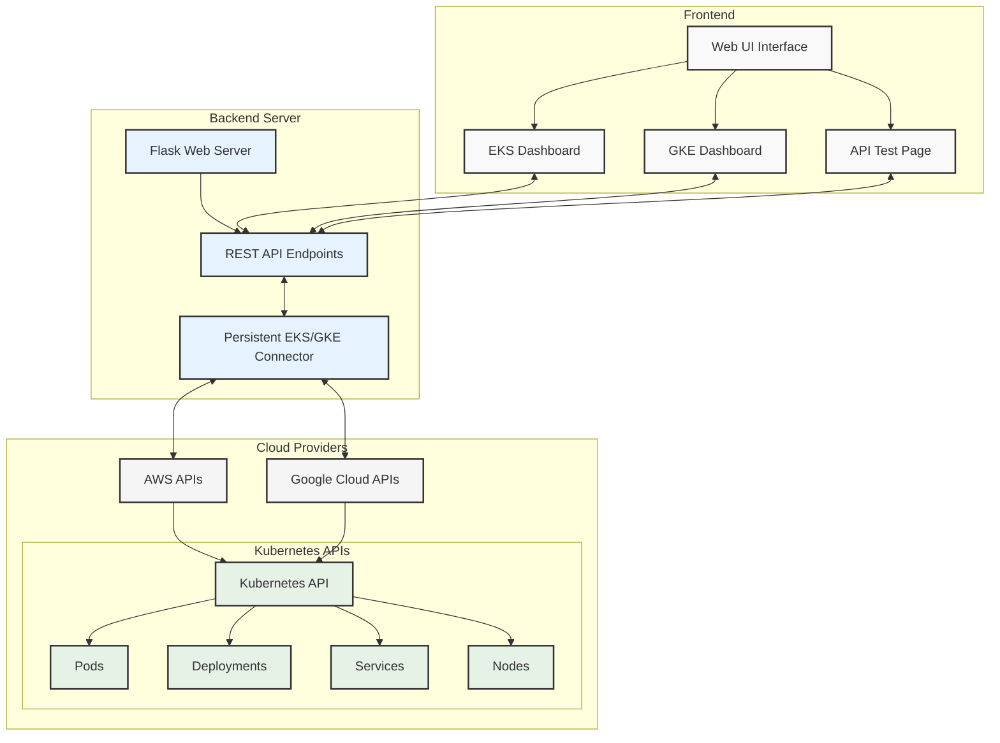
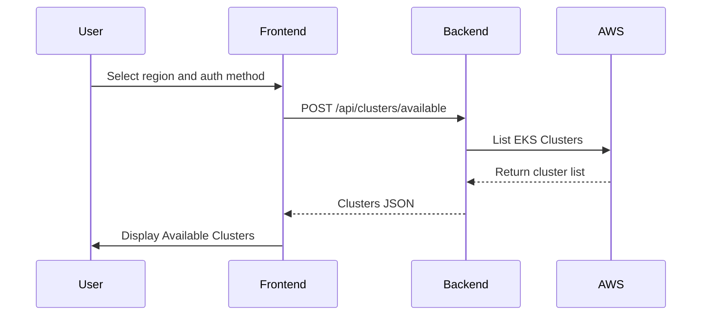
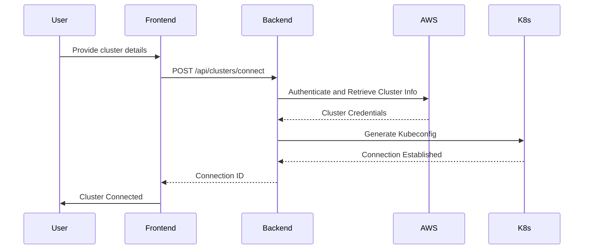
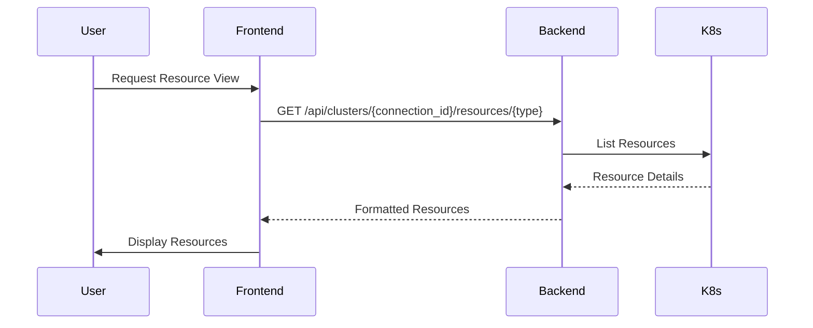

# SubbuK8sConsole Documentation

## Application Overview

SubbuK8sConsole is a powerful web-based application designed to simplify Kubernetes cluster management across multiple cloud providers. It provides a unified interface to connect to and monitor clusters from Amazon EKS (Elastic Kubernetes Service), offering comprehensive insights into your Kubernetes infrastructure.

## Architecture


```
+-------------------+        +-------------------+        +-------------------+
|   Frontend Layer  |        |   API Layer       |        |   Cloud Provider  |
|   (HTML/JS/CSS)  | <----> |   (Flask Backend) | <----> |   (AWS/GCP)       |
+-------------------+        +-------------------+        +-------------------+
        |                            |                            |
        |                            |                            |
+-------------------+        +-------------------+        +-------------------+
| Browser Interface |        | EKS Connector     |        | Kubernetes Cluster|
| (User Interaction)|        | (Resource Manager)|        | (EKS/GKE)         |
+-------------------+        +-------------------+        +-------------------+
```

### Component Breakdown

1. **Frontend Layer**
   - Built with HTML5, CSS3, JavaScript
   - Responsive design using Bootstrap
   - Handles user interactions
   - Sends API requests to backend
   - Renders cluster and resource information

2. **API Layer (Backend)**
   - Flask-based Python web server
   - Manages API endpoints
   - Handles authentication and resource retrieval
   - Interfaces with cloud providers
   - Provides RESTful API for cluster management

3. **Cloud Provider Connector**
   - Uses boto3 for AWS interactions
   - Manages cluster connections
   - Retrieves cluster metadata
   - Generates dynamic kubeconfig
   - Handles authentication methods

## API Workflow and Interaction Patterns

### Cluster Discovery Workflow



### Cluster Connection Workflow



### Resource Retrieval Workflow



## API Endpoints Overview

### Authentication and Cluster Management

| Endpoint | Method | Description | Authentication Required |
|----------|--------|-------------|-------------------------|
| `/api/clusters/connect` | POST | Connect to an EKS cluster | AWS Credentials/Profile |
| `/api/clusters/available` | POST | Discover available clusters | AWS Credentials/Profile |
| `/api/clusters` | GET | List connected clusters | None |
| `/api/clusters/<connection_id>/disconnect` | POST | Disconnect from a cluster | Connection ID |

### Resource Retrieval

| Endpoint | Method | Description | Authentication Required |
|----------|--------|-------------|-------------------------|
| `/api/clusters/<connection_id>/resources/<type>` | GET | Get cluster resources | Connection ID |
| `/api/clusters/<connection_id>/pods` | GET | Get pod information | Connection ID |

### Utility

| Endpoint | Method | Description |
|----------|--------|-------------|
| `/api/health` | GET | Check API status |

## Deployment Steps
# SubbuK8sConsole

A Kubernetes console UI built with Python and Flask.


## 🚀 Quick Start

### Prerequisites
- Python 3.6+
- Git
- pip (Python package manager)

### Installation & Setup

1. **Clone the Repository**
   ```bash
   git clone https://github.com/SubbuTechOps/python-k8s-console-ui.git
   cd python-k8s-console-ui
   ```

2. **Create Virtual Environment**
   ```bash
   # Create a virtual environment
   python -m venv venv

   # Activate the virtual environment
   # On Windows:
   venv\Scripts\activate
   # On macOS/Linux:
   source venv/bin/activate
   ```

3. **Install Dependencies**
   ```bash
   pip install -r requirements.txt
   ```

4. **Launch Application**
   ```bash
   cd ./backend
   python app.py
   ```

5. **Access the Console**
   - Open your browser and navigate to `http://localhost:5000`

## 📸 Screenshots

### Home Dashboard


### EKS Dashboard - No Clusters


### EKS Cluster Discovery


### EKS Cluster View


### Pod Management


### Deployment View


### Service Management


### Node Information


### GKE Dashboard (Coming Soon)


---

## 📋 Features

- Dashboard for Kubernetes cluster overview
- Pod management and monitoring
- Deployment configuration and scaling
- Service and ingress management
- Real-time logs and events
- Resource usage visualization

## 🔧 Configuration

The application can be configured using environment variables or a `.env` file in the project root:

```
K8S_CONTEXT=your-context
FLASK_ENV=development
FLASK_DEBUG=1
```

## 🔍 Troubleshooting

Common issues and solutions:

- **Port already in use**: Change the port in `app.py` or set `FLASK_RUN_PORT` environment variable
- **Kubernetes connection issues**: Ensure your kubeconfig is properly set up
- **Missing dependencies**: Verify virtual environment is activated before installing requirements

## 🚢 Deploying to Production

For production environments:

1. **Use a WSGI Server**
   ```bash
   pip install gunicorn
   gunicorn -w 4 -b 0.0.0.0:5000 app:app
   ```

2. **Set up a Reverse Proxy**
   - Configure Nginx or Apache as a reverse proxy
   - Enable HTTPS with Let's Encrypt certificates

3. **Set Environment Variables**
   ```bash
   export FLASK_ENV=production
   export FLASK_DEBUG=0
   ```

## 🤝 Contributing

Contributions are welcome! Please feel free to submit a Pull Request.

1. Fork the repository
2. Create your feature branch (`git checkout -b feature/amazing-feature`)
3. Commit your changes (`git commit -m 'Add some amazing feature'`)
4. Push to the branch (`git push origin feature/amazing-feature`)
5. Open a Pull Request

## 📝 License

This project is licensed under the MIT License 


## Authentication Methods

### 1. AWS Credentials Authentication
- Direct AWS access key authentication
- Supports temporary session tokens
- Provides granular access control

### 2. AWS Profile Authentication
- Uses pre-configured AWS profiles
- Simplifies credential management
- Default profile support

## Error Handling

The API provides comprehensive error responses:
- Detailed error messages
- Appropriate HTTP status codes
- Logging for backend diagnostics

## Security Considerations

1. **Credential Management**
   - Supports multiple authentication methods
   - Temporary credential support
   - No long-term credential storage

2. **API Security**
   - CORS support
   - Minimal persistent state
   - Stateless resource retrieval

## Deployment Considerations

- Supports containerized deployment
- Compatible with various hosting environments
- Minimal infrastructure requirements

## Future Enhancements

- Multi-cloud support expansion
- Enhanced authentication mechanisms
- Advanced resource management features
- Persistent cluster connection state
- Real-time cluster monitoring

## Getting Started

1. Configure AWS credentials
2. Install dependencies
3. Start the application
4. Discover and connect to clusters
5. Explore Kubernetes resources

## Troubleshooting

- Verify AWS credentials
- Check network connectivity
- Review application logs
- Ensure proper IAM permissions

---

**Built with ❤️ for Kubernetes Administrators**
